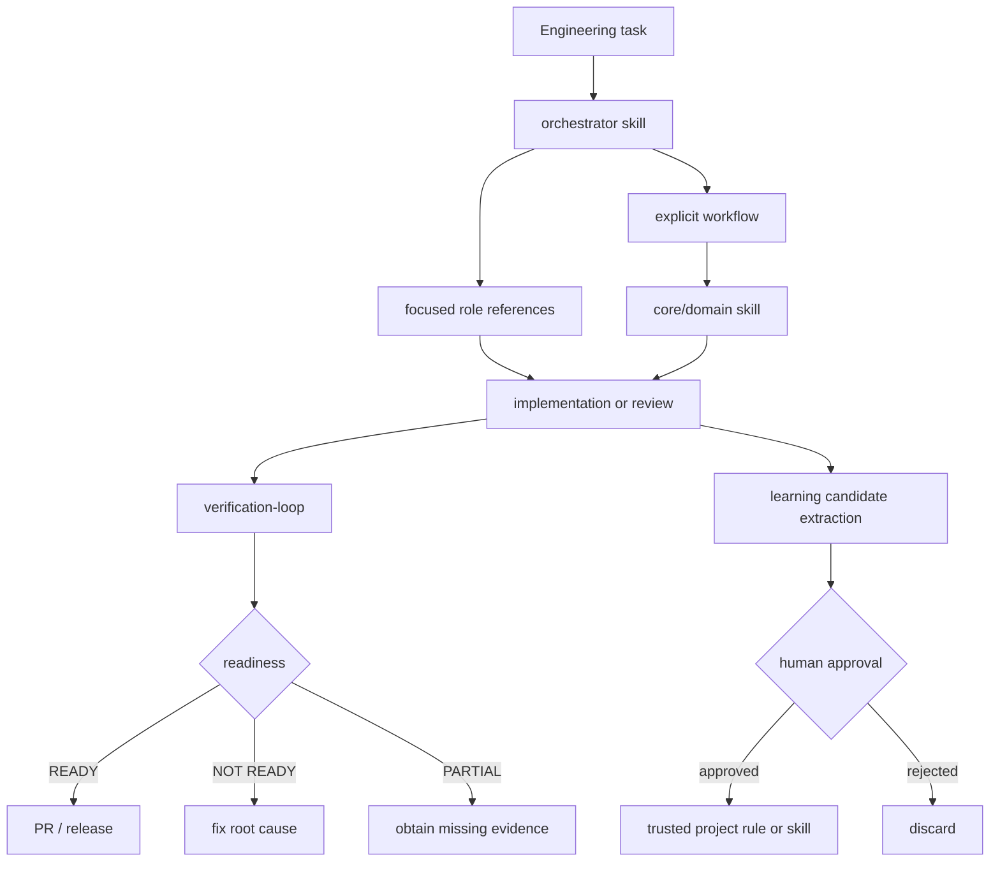

# Codex Engineering Kit

> A production-oriented engineering layer for OpenAI Codex: lean skills, focused role orchestration, evidence-based verification, eval-driven workflows, review-gated learning, and secret-safe MCP setup.

**Status:** v0.1 preview · Windows/PowerShell-first · public community project

Codex Engineering Kit is designed for engineers who want an AI coding workflow that does more than generate code. It turns planning, architecture, debugging, review, testing, security, performance work, and release readiness into explicit, inspectable engineering contracts.

It is **not an official OpenAI project** and does not claim compatibility with Claude Code hooks or other lifecycle APIs that Codex does not expose.

## Why it exists

Coding agents are useful, but production engineering fails when the workflow relies on invisible assumptions:

- architecture changes are proposed before the repository is inspected;
- tests are reported as "passed" without actually running;
- one-off session output becomes permanent guidance;
- every engineering persona becomes another always-visible skill and inflates context;
- local integration secrets leak into shared configuration;
- release decisions are based on model confidence instead of executable evidence.

Codex Engineering Kit makes those boundaries explicit.

## Core capabilities

| Capability | What it does |
|---|---|
| **Lean orchestration** | One active orchestrator routes work through focused role references instead of registering a separate skill for every persona. |
| **Verification loop** | Discovers repository-native build/type/lint/test commands and reports real exit status, evidence, blockers, and readiness. |
| **Eval harness** | Defines capability and regression evals with deterministic graders preferred over model judgment. |
| **Continuous learning** | Extracts reusable engineering candidates but requires human review before promotion to trusted guidance. |
| **Architecture discipline** | Requires repository evidence, explicit ownership, incremental migration, rollback, security, and performance analysis. |
| **Concurrency & performance** | Prioritizes correctness and measurement before parallelism or optimization. |
| **Safe installation** | Installs only toolkit-owned skills, tracks hashes in a manifest, supports dry-run, refuses unsafe overwrite, and backs up forced replacements. |
| **MCP safety** | Stores provider requirements and login metadata without committing tokens or project credentials. |

## Architecture



The key design choice is separation of concerns:

- **skills** contain reusable Codex-visible expertise;
- **role references** define focused responsibilities without bloating the active skill catalog;
- **workflows** define explicit entry conditions, evidence, procedure, failure handling, verification, and output contracts;
- **PowerShell scripts** implement inspectable local behavior such as installation, verification, and candidate extraction;
- **MCP templates** describe safe local setup requirements without storing credentials.

See [`docs/architecture.md`](docs/architecture.md) for the full model.

## Active skills

v0.1 deliberately exposes only six active skills:

```text
orchestrator
continuous-learning
eval-harness
verification-loop
software-architecture
concurrency-performance
```

The orchestrator references these engineering roles only when needed:

```text
architect
planner
code-reviewer
security-reviewer
build-error-resolver
e2e-runner
tdd-guide
refactor-cleaner
doc-updater
```

This keeps the active skill surface smaller while preserving specialized workflows.

## Quick start

### Requirements

- Windows 10/11 or Windows Server with **PowerShell 7+**
- Git
- OpenAI Codex CLI installed and authenticated
- Python 3.11+ only when running repository content validation/development checks

Clone the repository:

```powershell
git clone https://github.com/aydemir0/codex-engineering-kit.git
cd codex-engineering-kit
```

Preview the installation first:

```powershell
pwsh -NoProfile -File scripts/install.ps1 -DryRun
```

Install the six toolkit skills into the resolved Codex home:

```powershell
pwsh -NoProfile -File scripts/install.ps1
```

The installer resolves the destination in this order:

1. explicit `-CodexHome`
2. `CODEX_HOME`
3. `$HOME/.codex`

After installation, restart/open Codex and use `/skills` to confirm the toolkit skills are visible.

### Safe update

```powershell
pwsh -NoProfile -File scripts/update.ps1 -DryRun
pwsh -NoProfile -File scripts/update.ps1
```

If a toolkit target was modified locally, the updater refuses to overwrite it by default. `-Force` is explicit and creates a backup before replacement.

### Safe uninstall

```powershell
pwsh -NoProfile -File scripts/uninstall.ps1 -DryRun
pwsh -NoProfile -File scripts/uninstall.ps1
```

Uninstall removes only manifest-owned skill directories whose current tree hash still matches the installed manifest. Modified paths are preserved.

## Example workflow

Ask Codex to route a non-trivial task:

```text
Use $orchestrator to plan and implement this feature with the smallest necessary role set. Inspect the repository first and verify the final change with real project commands.
```

For an architecture decision:

```text
Use $software-architecture to inspect this repository and evaluate whether this boundary should remain in-process or become a separate service. Include migration and rollback.
```

For a performance problem:

```text
Use $concurrency-performance to establish the actual bottleneck before proposing concurrency or caching changes.
```

## Evidence-based verification

Run verification directly against a project:

```powershell
pwsh -NoProfile -File scripts/verify.ps1 -ProjectPath .
```

Or request machine-readable output:

```powershell
pwsh -NoProfile -File scripts/verify.ps1 -ProjectPath . -Json
```

For JavaScript/TypeScript repositories the v0.1 runner discovers common scripts from `package.json` and the project lockfile instead of assuming a single package manager. Each discovered gate records its real command and exit code. Missing gates are `SKIPPED`, never silently converted to `PASS`.

Readiness states:

- `READY` — discovered required gates and built-in safety checks passed;
- `NOT_READY` — a required executed gate or safety check failed;
- `PARTIAL` — used by the skill/workflow layer when required evidence cannot be obtained and a broader readiness claim would be misleading.

A dependency-free fixture is included at [`examples/sample-project`](examples/sample-project).

## Eval-driven engineering

`$eval-harness` separates:

- **capability evals** — can the new behavior be achieved?
- **regression evals** — did previously working behavior remain intact?

Grader priority is intentional:

1. deterministic/code-based;
2. model-assisted only where deterministic checks are insufficient;
3. human review for high-impact judgment.

Project-local eval artifacts belong under `.codex-kit/evals/`. Repeated-success metrics such as `pass@k` are reported only when the corresponding real attempts were executed.

## Continuous learning without auto-trust

The learning pipeline is deliberately conservative:

```text
completed work
  -> evidence extraction
  -> candidate normalization
  -> sensitive-data rejection
  -> deduplication
  -> confidence + scope
  -> pending_review
  -> human approval
```

Extract candidates from a user-curated observation file:

```powershell
pwsh -NoProfile -File scripts/learn-session.ps1 `
  -InputPath .codex-kit/local/observations.json `
  -OutputPath .codex-kit/candidates/session.json
```

Candidates are **not** installed as skills automatically and learned shell content is never executed automatically. See [`docs/learning.md`](docs/learning.md).

## Explicit lifecycle model

This project does not rename Claude-specific lifecycle hooks and pretend they exist in Codex.

For users who want a visible session wrapper, v0.1 provides:

```powershell
pwsh -NoProfile -File scripts/codex-wrapper.ps1
```

The wrapper performs an explicit Codex CLI preflight, can surface a user-provided checkpoint, launches Codex, and can optionally run candidate extraction on a user-provided observation file after the session.

## MCP integrations

Secret-free metadata templates are included for:

- GitHub
- Supabase
- Vercel
- Railway
- Cloudflare

Generate local provider metadata with:

```powershell
pwsh -NoProfile -File mcp/configure.ps1 `
  -Provider github `
  -OutputPath .codex-kit/local/github.mcp.json `
  -DryRun
```

The configurator does **not** write credentials. Providers that require login still require their supported local login flow. Environment-backed providers validate that required variables exist before generating local metadata.

## Project structure

```text
codex-engineering-kit/
├── skills/                 # Six active Codex skills
│   └── orchestrator/
│       └── references/     # Focused engineering role contracts
├── rules/                  # Engineering/security/testing/git/performance rules
├── contexts/               # Development/review/research references
├── workflows/              # Explicit engineering workflows
├── scripts/                # Install/update/uninstall/verify/learning/wrapper
├── mcp/                    # Secret-free provider templates + configurator
├── templates/              # Safe project-level AGENTS.md template
├── tests/                  # Contract and PowerShell behavior tests
├── examples/               # Dependency-free verification fixture
└── docs/                   # Design, architecture, learning, implementation plan
```

## Security model

The project separates five trust boundaries:

1. public repository contents vs local private state;
2. toolkit-owned installed files vs user-owned files;
3. trusted shipped skills vs untrusted learned candidates;
4. deterministic verification evidence vs model judgment;
5. local project data vs external MCP providers.

The repository must never contain real credentials, private project data, or raw private session transcripts. See [`SECURITY.md`](SECURITY.md).

## Development and CI

Repository contracts are checked with:

```powershell
python tests/validate_content.py
pwsh -NoProfile -File tests/Test-Install.ps1
pwsh -NoProfile -File tests/Test-Verify.ps1
pwsh -NoProfile -File tests/Test-Learning.ps1
pwsh -NoProfile -File tests/Test-Mcp.ps1
```

GitHub Actions runs content validation on Linux and behavior contracts on a Windows runner.

## Supported environments

| Environment | v0.1 status |
|---|---|
| Windows + PowerShell 7+ | First-class target |
| Codex CLI | Target runtime |
| Linux/macOS installer parity | Planned after v0.1 |
| Claude Code | Not required |

## Roadmap

Near-term priorities include:

- Linux/macOS installer parity;
- richer project-native verification discovery;
- reusable eval adapters;
- improved checkpoint/session-state tooling;
- broader MCP setup validation without storing credentials.

See [`ROADMAP.md`](ROADMAP.md).

## Attribution

Codex Engineering Kit is an independent implementation. Some workflow and agent-organization ideas were inspired by the MIT-licensed **Everything Claude Code** project by Affaan Mustafa. Claude-specific behavior has been redesigned rather than represented as native Codex functionality.

See [`THIRD_PARTY_NOTICES.md`](THIRD_PARTY_NOTICES.md) for attribution details.

No endorsement by OpenAI, Anthropic, or upstream project authors is implied.

## Contributing

Contributions are welcome, but changes to the active skill set, trust model, verification semantics, or installer ownership model are architectural changes and should include corresponding contract tests.

See [`CONTRIBUTING.md`](CONTRIBUTING.md).

## License

MIT License. See [`LICENSE`](LICENSE).
