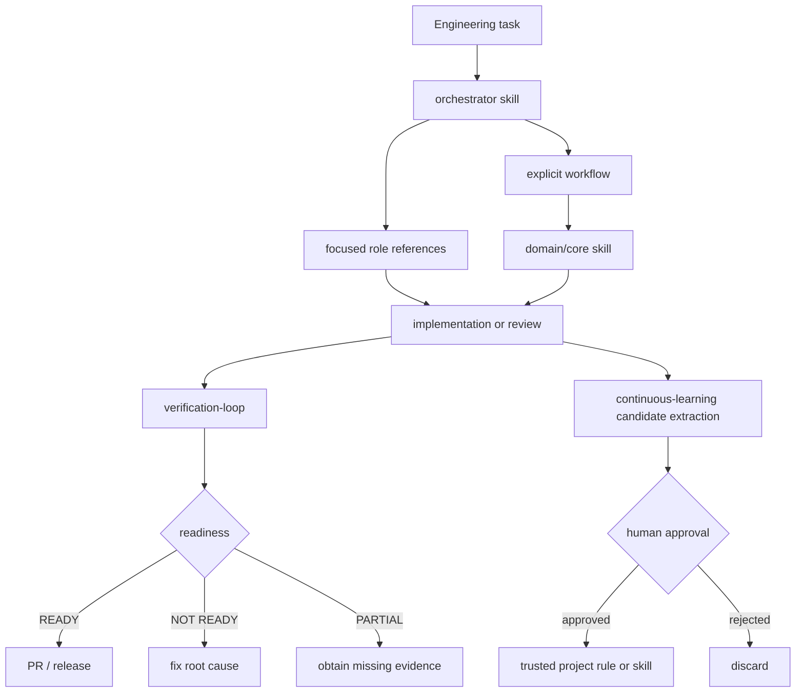

# Architecture

Codex Engineering Kit separates **active skills** from **reference roles**, **explicit workflows**, and **local automation**. The goal is to improve engineering discipline without filling Codex's skill context with one persona per task.



## Active skill boundary

v0.1 deliberately registers only six active skills:

- `orchestrator`
- `continuous-learning`
- `eval-harness`
- `verification-loop`
- `software-architecture`
- `concurrency-performance`

Engineering personas such as architect, planner, security reviewer, build resolver, and E2E runner are stored beneath the orchestrator as references. They do not become separate always-visible skills.

## Lifecycle model

The toolkit does not emulate Claude-specific hook names. Lifecycle behavior is explicit:

```text
scripts/codex-wrapper.ps1
  preflight
    -> optional checkpoint discovery
    -> launch Codex CLI
    -> optional user-supplied learning extraction
```

Quality gates live in workflows and `scripts/verify.ps1`, where command execution and evidence can be inspected directly.

## Installation boundary

The repository is the source of truth. `scripts/install.ps1` copies only toolkit-owned skill directories into the resolved Codex home and writes a deterministic ownership manifest. Forced replacement of unowned/modified targets creates a backup first. Uninstall removes only paths whose installed hash still matches the manifest.

## Trust boundaries

1. **Repository vs local state** — secrets and private learning data stay local.
2. **Toolkit-owned vs user-owned files** — manifest hashes prevent silent overwrite/removal.
3. **Trusted skills vs learned candidates** — promotion requires explicit approval.
4. **Deterministic checks vs model judgment** — deterministic evidence wins when available.
5. **Local project vs external MCP** — provider credentials are never stored in repository templates.
