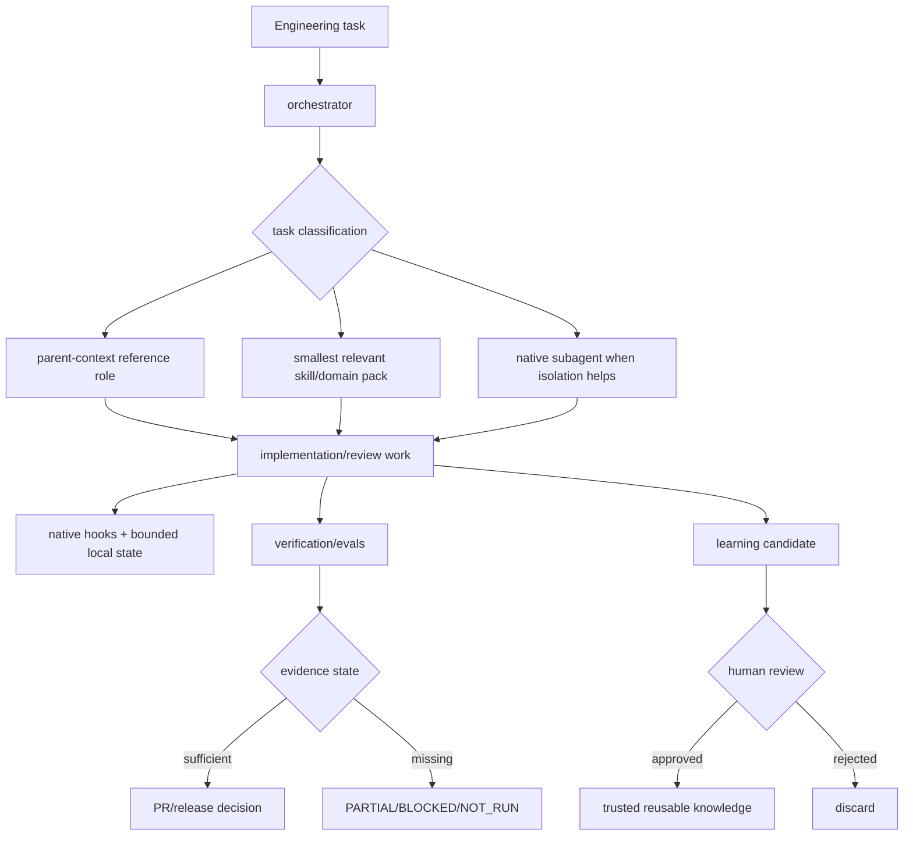

# Architecture

> Evidence-bound engineering workflows for OpenAI Codex.

Codex Engineering Kit (CEK) is an **independent** community project. It separates Codex-native packaging, orchestration, focused skills/subagents, lifecycle guardrails, bounded state, verification/evals, and release evidence so engineering behavior can be inspected instead of inferred from model confidence.

## Current implemented baseline

The current v0.2 implementation contains **8 shipped skills**:

- `backend-patterns`
- `concurrency-performance`
- `continuous-learning`
- `eval-harness`
- `frontend-patterns`
- `orchestrator`
- `software-architecture`
- `verification-loop`

It also contains **8 native subagents** under `.codex/agents/`:

- `architect`
- `build-resolver`
- `docs-researcher`
- `e2e-runner`
- `explorer`
- `refactor-cleaner`
- `reviewer`
- `security-reviewer`

Reference roles under `skills/orchestrator/references/roles/` are lightweight parent-context operating contracts. They are distinct from runtime-spawned native subagents and are not evidence that a separate agent executed.

Primary implementation surfaces:

```text
.codex-plugin/plugin.json
.agents/plugins/marketplace.json
.codex/agents/
hooks/hooks.json
hooks/scripts/
runtime/
skills/
workflows/
benchmarks/
release_contracts/
scripts/
tests/
docs/
```

The native plugin path and PowerShell-owned skill installer are separate delivery paths. Plugin metadata describes package structure; runtime compatibility is established only by release evidence.

## Current engineering flow



### Orchestration boundary

`orchestrator` classifies and routes work; it must not become an always-loaded encyclopedia. Reference roles shape parent-context execution. Domain skills are loaded when relevant. Native subagents are used only when independent context, review, or execution isolation has a concrete benefit, and delegation is claimed only when the runtime actually spawned one.

### Hook and state boundary

`hooks/hooks.json` is the current default native hook-discovery path. Hook behavior is a guardrail/evidence mechanism, not a security sandbox. Explicit manifest hook override remains governed by the compatibility matrix while RISK-001 is unresolved.

`runtime/` owns bounded local-state helpers. `.codex-kit` state remains local/ignored unless an explicit export format is introduced.

### Verification and release boundary

Deterministic evidence takes precedence when available: schemas/parsers, exit codes/tests, repository invariants, runtime acceptance, then model-assisted review. `release_contracts/` records allowed claim and compatibility states; three-OS repository CI is not blanket Codex runtime compatibility proof.

### Trust boundaries

1. Repository vs local sensitive state.
2. Toolkit-owned vs user-owned installed files.
3. Trusted shipped skills vs review-gated learned candidates.
4. Parent-context reference roles vs runtime-spawned native subagents.
5. Deterministic checks vs model judgment.
6. Local project state vs external MCP/app credentials and permissions.
7. CLI evidence vs Desktop evidence: neither is copied to the other without exact-runtime proof.

## v1.0 target architecture

The approved v1.0 design organizes CEK into eight target layers:

```text
User task
  -> Product entry / plugin discovery
  -> Orchestration and routing
  -> Focused native subagents
  -> Progressive-disclosure skills and domain packs
  -> Hooks, policy guardrails, bounded state
  -> Verification, evals, security and benchmark evidence
  -> Release contracts and compatibility gates
  -> Documentation, demo and OpenAI submission surfaces
```

This target is a design direction, **not a claim that every target layer is already release-ready**. Each layer closes through its own evidence-gated v1 workstream.

Source documents:

- `docs/superpowers/specs/2026-09-05-v1-openai-ready-product-architecture-design.md`
- `docs/superpowers/plans/2026-09-05-v1-openai-ready-master.md`
- `docs/release/compatibility-matrix.md`
- `docs/release/claim-evidence-matrix.md`
- `SECURITY.md`
