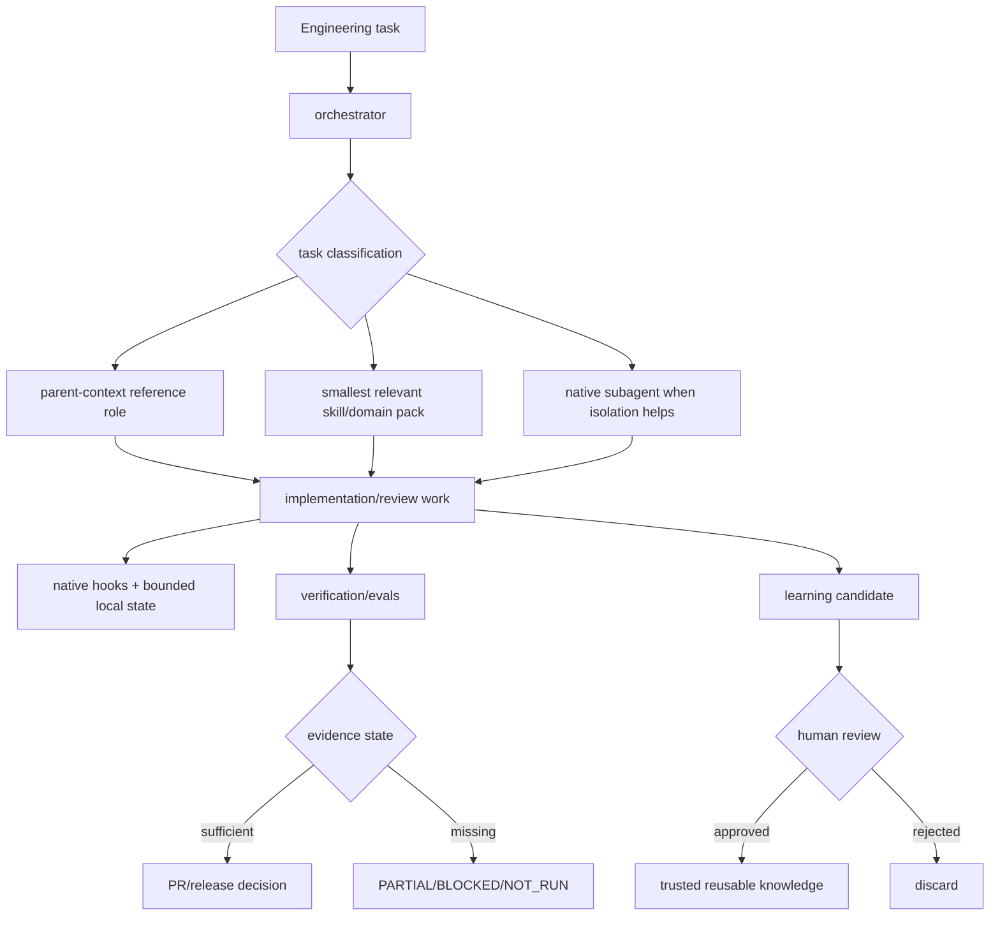

# CEK v1.0 Truth Surface Reconciliation Implementation Plan

> **For agentic workers:** REQUIRED SUB-SKILL: Use superpowers:subagent-driven-development (recommended) or superpowers:executing-plans to implement this plan task-by-task. Steps use checkbox (`- [ ]`) syntax for tracking.

**Goal:** Eliminate stale architecture/version/count contradictions and add deterministic contracts that keep CEK's public architecture narrative aligned with the actual shipped plugin, skills, native subagents, and v1 roadmap.

**Architecture:** Treat repository structure and machine-readable plugin/release data as implementation truth. Rewrite `docs/architecture.md` around the current v0.2 implementation boundary, separate that boundary from the approved v1 target, then enforce future drift detection in tests and CI.

**Tech Stack:** Python 3.11 `unittest`, Markdown, JSON plugin metadata, TOML native-agent inventory, GitHub Actions.

**Spec:** `docs/superpowers/specs/2026-09-05-v1-openai-ready-product-architecture-design.md`

## Global Constraints

- Public identity remains **Codex Engineering Kit** and must state independent-project boundaries.
- Do not describe a v1 target as already runtime-verified implementation.
- Shipped skills are discovered from `skills/*/SKILL.md`; tests must not impose a permanent marketing count.
- Native subagents are discovered from `.codex/agents/*.toml`; tests must detect future drift automatically.
- Orchestrator reference roles under `skills/orchestrator/references/roles/` are a separate asset class and must not be mislabeled as spawned native agents.
- `.codex-plugin/plugin.json` is package metadata, not runtime-compatibility proof.
- Three-OS repository CI is deterministic contract evidence, not blanket Codex runtime compatibility.
- Historical v0.2 runtime/RC evidence remains historical and may not be rewritten to make unresolved blockers appear closed.
- External GitHub repository metadata is not changed in this workstream.
- v0.2 PR #2 is not merged by this plan.

---

## File Structure

**Create:**
- `tests/test_architecture_contract.py` — dynamic contracts for skill/native-agent inventory, current-vs-target architecture wording, roadmap links, and CI inclusion.

**Modify:**
- `docs/architecture.md` — replace stale v0.1 six-skill/wrapper architecture with current v0.2 implementation plus explicitly future v1 target layers.
- `ROADMAP.md` — link the approved v1 design and master implementation plan while preserving v0.2 evidence boundaries.
- `README.md` — only if architecture/roadmap navigation is absent; do not rewrite already-correct evidence wording unnecessarily.
- `.github/workflows/ci.yml` — run the architecture truth contract in `content-contracts`.

**Read-only implementation truth:**
- `.codex-plugin/plugin.json`
- `skills/*/SKILL.md`
- `skills/orchestrator/references/roles/*.md`
- `.codex/agents/*.toml`
- `release_contracts/claims.json`
- `release_contracts/compatibility.json`
- `docs/release/compatibility-matrix.md`
- `docs/release/claim-evidence-matrix.md`
- `docs/release/v0.2-rc-checklist.md`

---

### Task 1: Add Failing Dynamic Architecture Contracts

**Files:**
- Create: `tests/test_architecture_contract.py`
- Read: current implementation/public files listed above.

**Interfaces:**
- Consumes: actual repository filesystem layout.
- Produces: `ArchitectureTruthContractTests`, which later tasks must satisfy without hard-coding a permanent catalog target.

- [ ] **Step 1: Create the failing contract file**

Create `tests/test_architecture_contract.py` with this content:

```python
from __future__ import annotations

import json
from pathlib import Path
import unittest


ROOT = Path(__file__).resolve().parents[1]
ARCHITECTURE = ROOT / "docs" / "architecture.md"
README = ROOT / "README.md"
ROADMAP = ROOT / "ROADMAP.md"
PLUGIN = ROOT / ".codex-plugin" / "plugin.json"
CI = ROOT / ".github" / "workflows" / "ci.yml"


def shipped_skills() -> tuple[str, ...]:
    return tuple(
        sorted(
            path.name
            for path in (ROOT / "skills").iterdir()
            if path.is_dir() and (path / "SKILL.md").is_file()
        )
    )


def native_agents() -> tuple[str, ...]:
    return tuple(
        sorted(path.stem for path in (ROOT / ".codex" / "agents").glob("*.toml"))
    )


class ArchitectureTruthContractTests(unittest.TestCase):
    def test_architecture_names_every_shipped_skill(self) -> None:
        text = ARCHITECTURE.read_text(encoding="utf-8")
        skills = shipped_skills()
        self.assertTrue(skills)
        for skill in skills:
            self.assertIn(f"`{skill}`", text)
        self.assertIn(f"{len(skills)} shipped skills", text)

    def test_architecture_names_every_native_agent(self) -> None:
        text = ARCHITECTURE.read_text(encoding="utf-8")
        agents = native_agents()
        self.assertTrue(agents)
        for agent in agents:
            self.assertIn(f"`{agent}`", text)
        self.assertIn(f"{len(agents)} native subagents", text)

    def test_architecture_removes_legacy_v01_primary_lifecycle(self) -> None:
        text = ARCHITECTURE.read_text(encoding="utf-8")
        self.assertNotIn("v0.1 deliberately registers only six active skills", text)
        self.assertNotIn("scripts/codex-wrapper.ps1\n  preflight", text)
        for required in (
            ".codex-plugin/plugin.json",
            ".codex/agents/",
            "hooks/hooks.json",
            "runtime/",
            "release_contracts/",
        ):
            self.assertIn(required, text)

    def test_architecture_separates_current_baseline_from_v1_target(self) -> None:
        text = ARCHITECTURE.read_text(encoding="utf-8")
        self.assertIn("## Current implemented baseline", text)
        self.assertIn("## v1.0 target architecture", text)
        target = text.split("## v1.0 target architecture", 1)[1]
        self.assertIn("target", target.casefold())
        self.assertIn(
            "not a claim that every target layer is already release-ready",
            target.casefold(),
        )

    def test_public_identity_uses_evidence_bound_positioning(self) -> None:
        plugin = json.loads(PLUGIN.read_text(encoding="utf-8"))
        readme = README.read_text(encoding="utf-8")
        architecture = ARCHITECTURE.read_text(encoding="utf-8")
        self.assertEqual(plugin["name"], "codex-engineering-kit")
        for text in (readme, architecture):
            self.assertIn("Codex Engineering Kit", text)
            self.assertIn("Evidence-bound engineering workflows for OpenAI Codex", text)
            self.assertIn("independent", text.casefold())

    def test_roadmap_links_v1_design_and_master_plan(self) -> None:
        text = ROADMAP.read_text(encoding="utf-8")
        self.assertIn(
            "docs/superpowers/specs/2026-09-05-v1-openai-ready-product-architecture-design.md",
            text,
        )
        self.assertIn(
            "docs/superpowers/plans/2026-09-05-v1-openai-ready-master.md",
            text,
        )

    def test_ci_runs_architecture_contract(self) -> None:
        text = CI.read_text(encoding="utf-8")
        content = text.split("  content-contracts:", 1)[1].split(
            "\n  powershell-contracts:", 1
        )[0]
        self.assertIn(
            "python -m unittest tests.test_architecture_contract -v",
            content,
        )


if __name__ == "__main__":
    unittest.main()
```

- [ ] **Step 2: Run the focused test and confirm RED**

```bash
python -m unittest tests.test_architecture_contract -v
```

Expected: FAIL. The current stale `docs/architecture.md`, ROADMAP link state, and CI inclusion should provide genuine RED evidence.

- [ ] **Step 3: Commit only the RED contract**

```bash
git add tests/test_architecture_contract.py
git commit -m "test: add v1 architecture truth contracts"
```

Expected: one independently reviewable RED-test commit.

---

### Task 2: Rewrite Architecture Documentation to the Current Truth Boundary

**Files:**
- Modify: `docs/architecture.md`
- Test: `tests/test_architecture_contract.py`

**Interfaces:**
- Consumes: dynamic inventories from Task 1 and the approved v1 design.
- Produces: one architecture narrative that explicitly distinguishes current implementation from target architecture.

- [ ] **Step 1: Replace the stale architecture document**

Rewrite `docs/architecture.md` with the following content. The four-backtick outer fence below is intentional so the target Markdown can contain its own `text` and `mermaid` fences without breaking this implementation plan.

````markdown
# Architecture

> Evidence-bound engineering workflows for OpenAI Codex.

Codex Engineering Kit (CEK) is an **independent** community project. It separates Codex-native packaging, orchestration, focused skills/subagents, lifecycle guardrails, bounded state, verification/evals, and release evidence so engineering behavior can be inspected instead of inferred from model confidence.

## Current implemented baseline

The current v0.2 implementation contains **8 shipped skills**:

- `backend-patterns`
- `concurrency-performance`
- `continuous-learning`
- `eval-harness`
- `frontend-patterns`
- `orchestrator`
- `software-architecture`
- `verification-loop`

It also contains **8 native subagents** under `.codex/agents/`:

- `architect`
- `build-resolver`
- `docs-researcher`
- `e2e-runner`
- `explorer`
- `refactor-cleaner`
- `reviewer`
- `security-reviewer`

Reference roles under `skills/orchestrator/references/roles/` are lightweight parent-context operating contracts. They are distinct from runtime-spawned native subagents and are not evidence that a separate agent executed.

Primary implementation surfaces:

```text
.codex-plugin/plugin.json
.agents/plugins/marketplace.json
.codex/agents/
hooks/hooks.json
hooks/scripts/
runtime/
skills/
workflows/
benchmarks/
release_contracts/
scripts/
tests/
docs/
```

The native plugin path and PowerShell-owned skill installer are separate delivery paths. Plugin metadata describes package structure; runtime compatibility is established only by release evidence.

## Current engineering flow



### Orchestration boundary

`orchestrator` classifies and routes work; it must not become an always-loaded encyclopedia. Reference roles shape parent-context execution. Domain skills are loaded when relevant. Native subagents are used only when independent context, review, or execution isolation has a concrete benefit, and delegation is claimed only when the runtime actually spawned one.

### Hook and state boundary

`hooks/hooks.json` is the current default native hook-discovery path. Hook behavior is a guardrail/evidence mechanism, not a security sandbox. Explicit manifest hook override remains governed by the compatibility matrix while RISK-001 is unresolved.

`runtime/` owns bounded local-state helpers. `.codex-kit` state remains local/ignored unless an explicit export format is introduced.

### Verification and release boundary

Deterministic evidence takes precedence when available: schemas/parsers, exit codes/tests, repository invariants, runtime acceptance, then model-assisted review. `release_contracts/` records allowed claim and compatibility states; three-OS repository CI is not blanket Codex runtime compatibility proof.

### Trust boundaries

1. Repository vs local sensitive state.
2. Toolkit-owned vs user-owned installed files.
3. Trusted shipped skills vs review-gated learned candidates.
4. Parent-context reference roles vs runtime-spawned native subagents.
5. Deterministic checks vs model judgment.
6. Local project state vs external MCP/app credentials and permissions.
7. CLI evidence vs Desktop evidence: neither is copied to the other without exact-runtime proof.

## v1.0 target architecture

The approved v1.0 design organizes CEK into eight target layers:

```text
User task
  -> Product entry / plugin discovery
  -> Orchestration and routing
  -> Focused native subagents
  -> Progressive-disclosure skills and domain packs
  -> Hooks, policy guardrails, bounded state
  -> Verification, evals, security and benchmark evidence
  -> Release contracts and compatibility gates
  -> Documentation, demo and OpenAI submission surfaces
```

This target is a design direction, **not a claim that every target layer is already release-ready**. Each layer closes through its own evidence-gated v1 workstream.

Source documents:

- `docs/superpowers/specs/2026-09-05-v1-openai-ready-product-architecture-design.md`
- `docs/superpowers/plans/2026-09-05-v1-openai-ready-master.md`
- `docs/release/compatibility-matrix.md`
- `docs/release/claim-evidence-matrix.md`
- `SECURITY.md`
````

- [ ] **Step 2: Run architecture contracts**

```bash
python -m unittest tests.test_architecture_contract -v
```

Expected: skill/native-agent/current-vs-target/public-identity tests PASS; ROADMAP and CI tests may remain RED until Tasks 3-4.

- [ ] **Step 3: Run release/content regressions**

```bash
python -m unittest tests.test_release_contract -v
python tests/validate_content.py
```

Expected: PASS. If an existing release-claim test fails, narrow architecture prose rather than weakening the release test.

- [ ] **Step 4: Commit the architecture rewrite**

```bash
git add docs/architecture.md
git commit -m "docs: reconcile CEK architecture with v0.2 truth"
```

---

### Task 3: Reconcile Roadmap and Reviewer Navigation

**Files:**
- Modify: `ROADMAP.md`
- Modify only if needed: `README.md`
- Test: `tests/test_architecture_contract.py`, `tests/test_release_contract.py`

**Interfaces:**
- Consumes: current architecture from Task 2.
- Produces: public navigation that distinguishes current v0.2 evidence from v1 target workstreams.

- [ ] **Step 1: Add the v1 program section to `ROADMAP.md`**

Add this section without deleting evidence-bound v0.2 history:

```markdown
## v1.0 — OpenAI-ready Codex-native engineering system

v1.0 is an evidence-gated program, not a catalog-size target. The approved architecture and execution program are:

- [`docs/superpowers/specs/2026-09-05-v1-openai-ready-product-architecture-design.md`](docs/superpowers/specs/2026-09-05-v1-openai-ready-product-architecture-design.md)
- [`docs/superpowers/plans/2026-09-05-v1-openai-ready-master.md`](docs/superpowers/plans/2026-09-05-v1-openai-ready-master.md)

The workstreams close in this order:

1. truth surface reconciliation;
2. runtime closure;
3. core workflow hardening;
4. security hardening;
5. skill/agent stocktake;
6. authenticated 45-run benchmark;
7. clean-install UX;
8. OpenAI-ready presentation;
9. exact-SHA/provenance v1.0 release gate.

A workstream is complete only when its tests/evidence pass. v1.0 is not release-ready merely because the roadmap item exists.
```

- [ ] **Step 2: Check README architecture/roadmap navigation**

```bash
python -c "from pathlib import Path; t=Path('README.md').read_text(encoding='utf-8'); print('docs/architecture.md' in t, 'ROADMAP.md' in t)"
```

If either output value is `False`, add:

```markdown
## Architecture and roadmap

- [`docs/architecture.md`](docs/architecture.md) — current implemented architecture vs approved v1 target;
- [`ROADMAP.md`](ROADMAP.md) — evidence-gated v0.2/v1 workstreams.
```

If both links already exist clearly, leave README untouched.

- [ ] **Step 3: Run public-surface tests**

```bash
python -m unittest tests.test_architecture_contract -v
python -m unittest tests.test_release_contract -v
python tests/validate_content.py
```

Expected: ROADMAP/public-surface assertions PASS; CI inclusion may remain the only RED architecture test.

- [ ] **Step 4: Commit roadmap/navigation changes**

```bash
git add ROADMAP.md
git add README.md 2>/dev/null || true
git commit -m "docs: connect v1 roadmap to architecture evidence"
```

On PowerShell, add README only when modified rather than using the shell snippet above.

---

### Task 4: Enforce Architecture Truth in CI

**Files:**
- Modify: `.github/workflows/ci.yml`
- Test: `tests/test_architecture_contract.py`

**Interfaces:**
- Consumes: completed truth contracts from Tasks 1-3.
- Produces: automatic PR enforcement against future architecture drift.

- [ ] **Step 1: Add architecture validation to `content-contracts`**

Directly after the repository-content validation step, add:

```yaml
      - name: Validate architecture truth contract
        run: python -m unittest tests.test_architecture_contract -v
```

Do not add authenticated Codex execution to this deterministic job.

- [ ] **Step 2: Run the complete truth-surface suite**

```bash
python -m unittest tests.test_architecture_contract -v
python -m unittest tests.test_release_contract -v
python tests/validate_content.py
```

Expected: all PASS.

- [ ] **Step 3: Verify the CI-specific assertion directly**

```bash
python -m unittest tests.test_architecture_contract.ArchitectureTruthContractTests.test_ci_runs_architecture_contract -v
```

Expected: PASS.

- [ ] **Step 4: Commit CI enforcement**

```bash
git add .github/workflows/ci.yml
git commit -m "ci: enforce architecture truth contract"
```

---

### Task 5: Independent Review and Workstream Closure

**Files:**
- Review: every path changed in Tasks 1-4.
- Record: exact closure SHA in the v1 execution ledger; do not modify runtime compatibility status here.

**Interfaces:**
- Consumes: green deterministic truth-surface implementation.
- Produces: reviewed architecture truth suitable for later runtime/security/presentation workstreams.

- [ ] **Step 1: Run fresh-context spec review**

Reviewer checklist:

```text
1. Does docs/architecture.md describe every actual shipped skill?
2. Does it describe every actual native subagent?
3. Does it distinguish reference roles from spawned native subagents?
4. Is the old v0.1 six-skill/wrapper lifecycle removed as the primary architecture?
5. Are current v0.2 implementation and future v1 target clearly separated?
6. Did any prose broaden CLI/Desktop/runtime compatibility beyond release evidence?
7. Did historical v0.2 blockers remain intact?
8. Does CI enforce future drift detection?
9. Are README/ROADMAP navigation paths correct?
```

Expected: no unresolved critical/major finding.

- [ ] **Step 2: Run final verification from the reviewed head**

```bash
python -m unittest tests.test_architecture_contract -v
python -m unittest tests.test_release_contract -v
python tests/validate_content.py
git status --short
git rev-parse HEAD
```

Expected: all tests PASS, clean tree, exact reviewed SHA recorded.

- [ ] **Step 3: Close only the proven boundary**

Allowed conclusion:

```text
Truth surface reconciliation is closed at the deterministic repository boundary.
```

Forbidden conclusion:

```text
v1.0 is runtime compatible / release-ready.
```

---

## Completion Criteria

This workstream is complete when `tests/test_architecture_contract.py` dynamically tracks real shipped skills/native subagents; `docs/architecture.md` no longer presents stale v0.1 architecture as current; reference-role/native-subagent boundaries are explicit; current v0.2 implementation and future v1 target are separated; ROADMAP links approved v1 spec/master plan; CI runs the architecture contract; release/content regressions remain green; and an independent reviewer records a clean exact closure SHA.