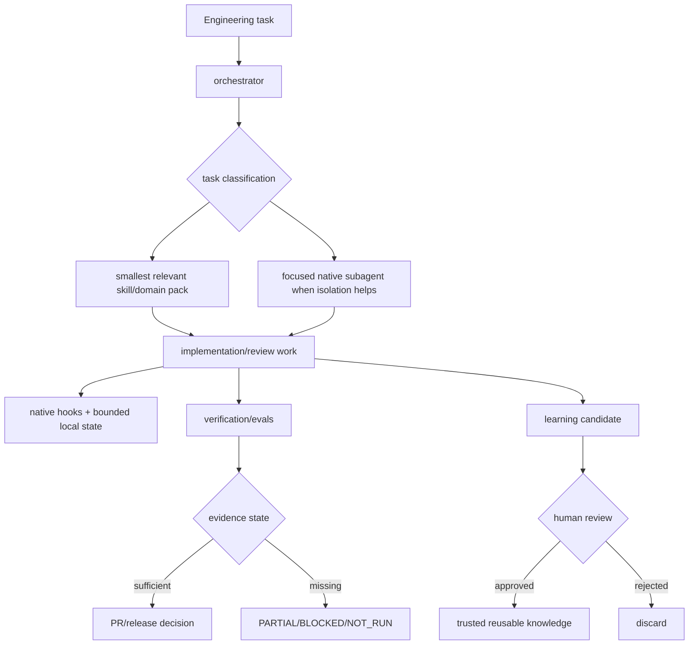

# CEK v1.0 Truth Surface Reconciliation Implementation Plan

> **For agentic workers:** REQUIRED SUB-SKILL: Use superpowers:subagent-driven-development (recommended) or superpowers:executing-plans to implement this plan task-by-task. Steps use checkbox (`- [ ]`) syntax for tracking.

**Goal:** Eliminate stale architecture/version/count contradictions and add deterministic contracts that keep CEK's public architecture narrative aligned with the actual shipped plugin, skills, agents, and v1 roadmap.

**Architecture:** Treat repository structure and machine-readable plugin/release data as implementation truth, then make `docs/architecture.md`, README/ROADMAP references, and CI validate against that truth. The architecture document must clearly separate the current implemented v0.2 baseline from the approved v1.0 target so future design does not become a false current-state claim.

**Tech Stack:** Python 3.11 `unittest`, Markdown, JSON plugin metadata, TOML agent inventory, GitHub Actions.

**Spec:** `docs/superpowers/specs/2026-09-05-v1-openai-ready-product-architecture-design.md`

## Global Constraints

- Public identity remains **Codex Engineering Kit** and must state independent-project boundaries.
- Do not describe v1 target features as currently verified implementation.
- Current shipped skills are discovered from `skills/*/SKILL.md`; tests must not hard-code a permanent marketing target for skill count.
- Current native agents are discovered from `.codex/agents/*.toml`; tests must detect future drift automatically.
- Native plugin metadata in `.codex-plugin/plugin.json` remains implementation metadata, not proof of runtime compatibility.
- Three-OS CI remains repository-contract evidence, not blanket runtime compatibility evidence.
- Historical v0.2 runtime/RC evidence must not be rewritten to pretend unresolved blockers were closed.
- Do not change GitHub repository metadata in this workstream; external metadata remains separately tracked until a supported administration write path or manual update is verified.
- v0.2 PR #2 is not merged by this plan.

---

## File Structure

**Create:**
- `tests/test_architecture_contract.py` — dynamic contracts for skill/agent inventory, current-vs-target architecture wording, roadmap links, and CI inclusion.

**Modify:**
- `docs/architecture.md` — replace stale v0.1 six-skill/wrapper description with current v0.2 implementation + explicitly future v1 target layers.
- `ROADMAP.md` — link the approved v1 design and master implementation plan while preserving v0.2 evidence boundaries.
- `README.md` — only if failing architecture contracts show a missing architecture/roadmap reviewer link; do not rewrite already-correct evidence wording unnecessarily.
- `.github/workflows/ci.yml` — run the architecture contract in the existing `content-contracts` job.

**Read-only sources of implementation truth:**
- `.codex-plugin/plugin.json`
- `skills/*/SKILL.md`
- `.codex/agents/*.toml`
- `release_contracts/claims.json`
- `release_contracts/compatibility.json`
- `docs/release/compatibility-matrix.md`
- `docs/release/claim-evidence-matrix.md`
- `docs/release/v0.2-rc-checklist.md`

---

### Task 1: Add Failing Dynamic Architecture Contracts

**Files:**
- Create: `tests/test_architecture_contract.py`
- Read: `.codex-plugin/plugin.json`
- Read: `skills/*/SKILL.md`
- Read: `.codex/agents/*.toml`
- Read: `docs/architecture.md`
- Read: `ROADMAP.md`
- Read: `.github/workflows/ci.yml`

**Interfaces:**
- Consumes: repository filesystem layout plus current Markdown/public surfaces.
- Produces: `ArchitectureTruthContractTests`, a deterministic suite that later tasks must satisfy.

- [ ] **Step 1: Create the failing architecture contract test file**

Create `tests/test_architecture_contract.py` with exactly this content:

```python
from __future__ import annotations

import json
from pathlib import Path
import unittest


ROOT = Path(__file__).resolve().parents[1]
ARCHITECTURE = ROOT / "docs" / "architecture.md"
README = ROOT / "README.md"
ROADMAP = ROOT / "ROADMAP.md"
PLUGIN = ROOT / ".codex-plugin" / "plugin.json"
CI = ROOT / ".github" / "workflows" / "ci.yml"


def shipped_skills() -> tuple[str, ...]:
    names = []
    for path in (ROOT / "skills").iterdir():
        if path.is_dir() and (path / "SKILL.md").is_file():
            names.append(path.name)
    return tuple(sorted(names))


def native_agents() -> tuple[str, ...]:
    return tuple(sorted(path.stem for path in (ROOT / ".codex" / "agents").glob("*.toml")))


class ArchitectureTruthContractTests(unittest.TestCase):
    def test_architecture_names_every_shipped_skill(self) -> None:
        text = ARCHITECTURE.read_text(encoding="utf-8")
        skills = shipped_skills()
        self.assertTrue(skills)
        for skill in skills:
            self.assertIn(f"`{skill}`", text)
        self.assertIn(f"{len(skills)} shipped skills", text)

    def test_architecture_names_every_native_agent(self) -> None:
        text = ARCHITECTURE.read_text(encoding="utf-8")
        agents = native_agents()
        self.assertTrue(agents)
        for agent in agents:
            self.assertIn(f"`{agent}`", text)
        self.assertIn(f"{len(agents)} native subagents", text)

    def test_architecture_removes_legacy_v01_primary_lifecycle(self) -> None:
        text = ARCHITECTURE.read_text(encoding="utf-8")
        self.assertNotIn("v0.1 deliberately registers only six active skills", text)
        self.assertNotIn("scripts/codex-wrapper.ps1\n  preflight", text)
        for required in (
            ".codex-plugin/plugin.json",
            ".codex/agents/",
            "hooks/hooks.json",
            "runtime/",
            "release_contracts/",
        ):
            self.assertIn(required, text)

    def test_architecture_separates_current_baseline_from_v1_target(self) -> None:
        text = ARCHITECTURE.read_text(encoding="utf-8")
        self.assertIn("## Current implemented baseline", text)
        self.assertIn("## v1.0 target architecture", text)
        target = text.split("## v1.0 target architecture", 1)[1]
        self.assertIn("target", target.casefold())
        self.assertIn("not a claim that every target layer is already release-ready", target.casefold())

    def test_public_identity_uses_evidence_bound_positioning(self) -> None:
        plugin = json.loads(PLUGIN.read_text(encoding="utf-8"))
        readme = README.read_text(encoding="utf-8")
        architecture = ARCHITECTURE.read_text(encoding="utf-8")
        self.assertEqual(plugin["name"], "codex-engineering-kit")
        for text in (readme, architecture):
            self.assertIn("Codex Engineering Kit", text)
            self.assertIn("Evidence-bound engineering workflows for OpenAI Codex", text)
            self.assertIn("independent", text.casefold())

    def test_roadmap_links_v1_design_and_master_plan(self) -> None:
        text = ROADMAP.read_text(encoding="utf-8")
        self.assertIn(
            "docs/superpowers/specs/2026-09-05-v1-openai-ready-product-architecture-design.md",
            text,
        )
        self.assertIn(
            "docs/superpowers/plans/2026-09-05-v1-openai-ready-master.md",
            text,
        )

    def test_ci_runs_architecture_contract(self) -> None:
        text = CI.read_text(encoding="utf-8")
        content = text.split("  content-contracts:", 1)[1].split("\n  powershell-contracts:", 1)[0]
        self.assertIn("python -m unittest tests.test_architecture_contract -v", content)


if __name__ == "__main__":
    unittest.main()
```

- [ ] **Step 2: Run the focused test and confirm RED**

Run:

```bash
python -m unittest tests.test_architecture_contract -v
```

Expected: FAIL. At minimum the current `docs/architecture.md` fails the current/target headings, eight-skill inventory wording, native-agent inventory, and legacy lifecycle assertions; `ROADMAP.md`/CI also fail until later tasks.

- [ ] **Step 3: Commit only the failing contract**

```bash
git add tests/test_architecture_contract.py
git commit -m "test: add v1 architecture truth contracts"
```

Expected: one RED-test commit suitable for independent review.

---

### Task 2: Rewrite Architecture Documentation to the Current Truth Boundary

**Files:**
- Modify: `docs/architecture.md`
- Test: `tests/test_architecture_contract.py`

**Interfaces:**
- Consumes: dynamic inventories from Task 1 and approved v1 design spec.
- Produces: a single architecture narrative that distinguishes current implementation from target architecture.

- [ ] **Step 1: Replace the stale architecture document**

Rewrite `docs/architecture.md` to contain the following structure and facts. Preserve the wording boundaries shown below; additional explanatory prose is allowed only when it does not broaden runtime claims.

```markdown
# Architecture

> Evidence-bound engineering workflows for OpenAI Codex.

Codex Engineering Kit (CEK) is an **independent** community project. It separates Codex-native packaging, orchestration, focused skills/subagents, lifecycle guardrails, bounded state, verification/evals, and release evidence so that engineering behavior can be inspected instead of inferred from model confidence.

## Current implemented baseline

The current v0.2 implementation contains **8 shipped skills**:

- `backend-patterns`
- `concurrency-performance`
- `continuous-learning`
- `eval-harness`
- `frontend-patterns`
- `orchestrator`
- `software-architecture`
- `verification-loop`

It also contains **8 native subagents** under `.codex/agents/`:

- `architect`
- `build-resolver`
- `docs-researcher`
- `e2e-runner`
- `explorer`
- `refactor-cleaner`
- `reviewer`
- `security-reviewer`

Primary implementation surfaces:

```text
.codex-plugin/plugin.json
.agents/plugins/marketplace.json
.codex/agents/
hooks/hooks.json
hooks/scripts/
runtime/
skills/
workflows/
benchmarks/
release_contracts/
scripts/
tests/
docs/
```

The native plugin path and the PowerShell-owned skill installer are separate delivery paths. The plugin metadata describes package structure; runtime compatibility is established only by the release evidence matrix.

## Current engineering flow



### Orchestration boundary

`orchestrator` classifies and routes work; it must not become an always-loaded encyclopedia. Domain skills are loaded when relevant. Native subagents are used when independent context, review, or execution isolation has a concrete benefit.

### Hook and state boundary

`hooks/hooks.json` is the current default native hook-discovery path. Hook behavior is a guardrail/evidence mechanism, not a security sandbox. Explicit manifest hook override remains governed by the compatibility matrix while RISK-001 is unresolved.

`runtime/` owns bounded, versioned local-state helpers. `.codex-kit` state is local/ignored unless an explicit export format is introduced.

### Verification and release boundary

Deterministic evidence takes precedence when available: schemas/parsers, exit codes/tests, repository invariants, runtime acceptance, then model-assisted review. `release_contracts/` records allowed claim and compatibility states; three-OS repository CI is not blanket Codex runtime compatibility proof.

### Trust boundaries

1. Repository vs local sensitive state.
2. Toolkit-owned vs user-owned installed files.
3. Trusted shipped skills vs review-gated learned candidates.
4. Deterministic checks vs model judgment.
5. Local project state vs external MCP/app credentials and permissions.
6. CLI evidence vs Desktop evidence: neither is copied to the other without exact-runtime proof.

## v1.0 target architecture

The approved v1.0 design organizes CEK into eight target layers:

```text
User task
  -> Product entry / plugin discovery
  -> Orchestration and routing
  -> Focused native subagents
  -> Progressive-disclosure skills and domain packs
  -> Hooks, policy guardrails, bounded state
  -> Verification, evals, security and benchmark evidence
  -> Release contracts and compatibility gates
  -> Documentation, demo and OpenAI submission surfaces
```

This target is a design direction, **not a claim that every target layer is already release-ready**. Each layer closes through its own evidence-gated v1 workstream.

Source documents:

- `docs/superpowers/specs/2026-09-05-v1-openai-ready-product-architecture-design.md`
- `docs/superpowers/plans/2026-09-05-v1-openai-ready-master.md`
- `docs/release/compatibility-matrix.md`
- `docs/release/claim-evidence-matrix.md`
- `SECURITY.md`
```

- [ ] **Step 2: Run architecture contracts**

```bash
python -m unittest tests.test_architecture_contract -v
```

Expected: skill/agent/current-vs-target/public-identity tests PASS; roadmap and CI tests may still FAIL because those files are handled in Tasks 3-4.

- [ ] **Step 3: Run release regression contracts**

```bash
python -m unittest tests.test_release_contract -v
python tests/validate_content.py
```

Expected: PASS. If an existing release claim test fails, narrow the architecture prose rather than weakening the release test.

- [ ] **Step 4: Commit the architecture rewrite**

```bash
git add docs/architecture.md
git commit -m "docs: reconcile CEK architecture with v0.2 truth"
```

---

### Task 3: Reconcile the Public Roadmap and Reviewer Navigation

**Files:**
- Modify: `ROADMAP.md`
- Modify only if needed: `README.md`
- Test: `tests/test_architecture_contract.py`
- Test: `tests/test_release_contract.py`

**Interfaces:**
- Consumes: architecture truth from Task 2 and approved v1 spec/master plan paths.
- Produces: a roadmap that distinguishes current v0.2 evidence from v1 target workstreams and gives reviewers a direct path to architecture/release evidence.

- [ ] **Step 1: Add an explicit v1.0 program section to `ROADMAP.md`**

Add this section without deleting the existing evidence-bound v0.2 history:

```markdown
## v1.0 — OpenAI-ready Codex-native engineering system

v1.0 is an evidence-gated program, not a catalog-size target. The approved architecture and execution program are:

- [`docs/superpowers/specs/2026-09-05-v1-openai-ready-product-architecture-design.md`](docs/superpowers/specs/2026-09-05-v1-openai-ready-product-architecture-design.md)
- [`docs/superpowers/plans/2026-09-05-v1-openai-ready-master.md`](docs/superpowers/plans/2026-09-05-v1-openai-ready-master.md)

The workstreams close in this order:

1. truth surface reconciliation;
2. runtime closure;
3. core workflow hardening;
4. security hardening;
5. skill/agent stocktake;
6. authenticated 45-run benchmark;
7. clean-install UX;
8. OpenAI-ready presentation;
9. exact-SHA v1.0 release gate.

A workstream is complete only when its tests/evidence pass. v1.0 is not release-ready merely because the roadmap item exists.
```

- [ ] **Step 2: Ensure README links the current architecture and roadmap**

Check:

```bash
python - <<'PY'
from pathlib import Path
text = Path('README.md').read_text(encoding='utf-8')
print('docs/architecture.md' in text, 'ROADMAP.md' in text)
PY
```

If either result is `False`, add a small `## Architecture and roadmap` section near the release-evidence links:

```markdown
## Architecture and roadmap

- [`docs/architecture.md`](docs/architecture.md) — current implemented architecture vs approved v1 target;
- [`ROADMAP.md`](ROADMAP.md) — evidence-gated v0.2/v1 workstreams.
```

If both are already clearly linked, do not edit README.

- [ ] **Step 3: Run public-surface tests**

```bash
python -m unittest tests.test_architecture_contract -v
python -m unittest tests.test_release_contract -v
python tests/validate_content.py
```

Expected: roadmap-link test now PASS; only CI-inclusion test may remain FAIL.

- [ ] **Step 4: Commit roadmap/navigation changes**

```bash
git add ROADMAP.md README.md
git commit -m "docs: connect v1 roadmap to architecture evidence"
```

If README was unchanged, omit it from `git add`.

---

### Task 4: Enforce Architecture Truth in CI

**Files:**
- Modify: `.github/workflows/ci.yml`
- Test: `tests/test_architecture_contract.py`

**Interfaces:**
- Consumes: completed architecture contracts from Tasks 1-3.
- Produces: automatic pull-request enforcement preventing stale architecture from landing unnoticed.

- [ ] **Step 1: Add architecture validation to `content-contracts`**

In `.github/workflows/ci.yml`, directly after `Validate repository contracts`, add:

```yaml
      - name: Validate architecture truth contract
        run: python -m unittest tests.test_architecture_contract -v
```

Do not add Codex runtime execution to this deterministic content job.

- [ ] **Step 2: Run the complete truth-surface suite locally**

```bash
python -m unittest tests.test_architecture_contract -v
python -m unittest tests.test_release_contract -v
python tests/validate_content.py
```

Expected: all PASS.

- [ ] **Step 3: Verify the CI contract itself sees the command**

```bash
python -m unittest tests.test_architecture_contract.ArchitectureTruthContractTests.test_ci_runs_architecture_contract -v
```

Expected: PASS.

- [ ] **Step 4: Commit CI enforcement**

```bash
git add .github/workflows/ci.yml
git commit -m "ci: enforce architecture truth contract"
```

---

### Task 5: Independent Review and Workstream Closure

**Files:**
- Review: all files changed by Tasks 1-4
- Record: exact closure SHA in the v1 execution ledger/master-plan tracking process; do not modify release compatibility state in this task.

**Interfaces:**
- Consumes: green deterministic truth-surface implementation.
- Produces: reviewed workstream closure suitable as an input to runtime/security/presentation work.

- [ ] **Step 1: Run a spec-compliance review in a fresh context**

Reviewer checklist:

```text
1. Does docs/architecture.md describe the actual 8 shipped skill directories?
2. Does it describe the actual 8 native agent TOMLs?
3. Is the old v0.1 six-skill/wrapper lifecycle removed as the primary architecture?
4. Are current v0.2 implementation and future v1 target clearly separated?
5. Did any prose broaden CLI/Desktop/runtime compatibility beyond release evidence?
6. Did historical v0.2 blockers remain intact?
7. Does CI enforce future drift detection?
8. Are README/ROADMAP navigation paths correct?
```

Expected: no unresolved critical or major finding.

- [ ] **Step 2: Run final verification from the reviewed head**

```bash
python -m unittest tests.test_architecture_contract -v
python -m unittest tests.test_release_contract -v
python tests/validate_content.py
git status --short
git rev-parse HEAD
```

Expected: tests PASS, working tree clean, exact reviewed head recorded.

- [ ] **Step 3: Confirm workstream closure boundary**

```text
Allowed conclusion:
"Truth surface reconciliation is closed at the deterministic repository boundary."

Not allowed:
"v1.0 is runtime compatible / release-ready."
```

---

## Completion Criteria

This workstream is complete when:

- `tests/test_architecture_contract.py` dynamically tracks real skill and native-agent inventory;
- `docs/architecture.md` no longer describes the stale v0.1 six-skill/wrapper lifecycle as current;
- current v0.2 implementation and future v1 target are explicitly separated;
- `ROADMAP.md` links the approved v1 spec/master plan;
- README links architecture/roadmap if those links were previously absent;
- existing release-contract tests remain green without weakening claim boundaries;
- CI runs the architecture truth contract;
- a fresh reviewer finds no major spec or overclaim defect;
- final exact SHA is recorded with a clean tree.
